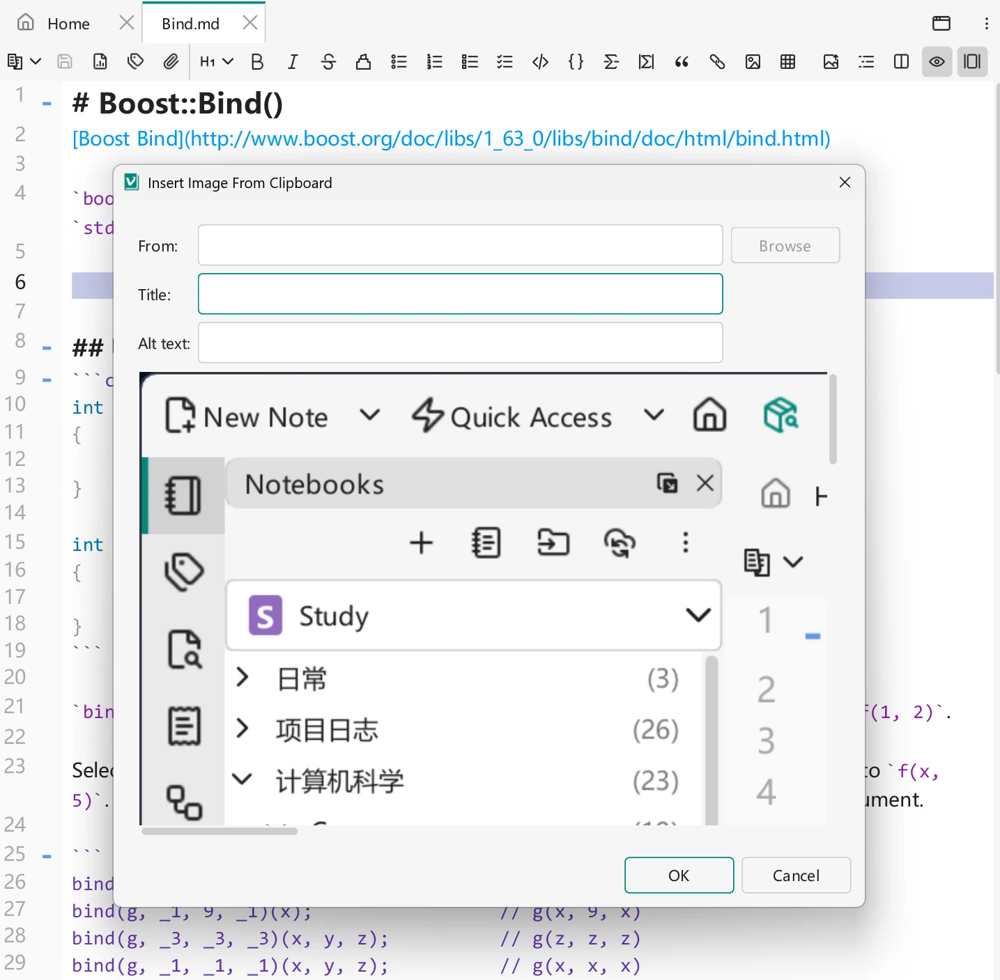

# Images & Image Host

Notes often need pictures, and VNote makes images painless: paste one and it is saved into your notebook and linked automatically. When you want to share a plain Markdown file without shipping the image files, an **image host** stores your pictures online instead.

## Inserting images

The fastest way to add an image is to **paste** it (a screenshot, or an image copied from elsewhere) directly into the editor. VNote:

1. Saves the image file into the notebook's assets — by default under a `vx_assets` folder in the notebook root (in a per-note subfolder).
2. Inserts the Markdown link for you.

You can also insert an image from a file, or drag and drop one into the editor. Because images live inside the notebook, they travel with it when you copy or [sync](../managing-notes/notebook-sync.md) the notebook.

{ .screenshot loading=lazy }

```md

```

## Local images vs. image host

VNote supports two storage strategies, and you can switch between them per note in the editor:

- **Local images** — files are stored inside the notebook. Self-contained and offline-friendly.
- **Image host** — images are uploaded to an online service, and the note links to the online URL. The Markdown file then references nothing local, so you can share the plain text and readers see the images from anywhere.

A useful workflow when your connection is poor: insert images **locally** while writing, then **upload all images** in the note to an image host at the end.

## What an image host is

An **image host** is an online service that holds your images. Unlike local images, an image-hosted note carries no image files with it — you can hand someone just the Markdown text and they still see every picture, loaded online.

## Setting up an image host

First configure an image host in **Settings**. VNote supports three image-host types — **GitHub Repository**, **Gitee Repository**, and **Custom Command** — then choose local images or the image host in the editor.

### GitHub / Gitee

Gitee follows a similar process; GitHub is used here as the example.

1. In GitHub, go to **Settings → Developer settings** and generate a new **Personal access token**.
2. Select the **repo** scope, generate the token, and copy it.
3. Create a **public** repository to hold the images. Generate the default `README` so the repository has an initial commit.
4. In VNote, add a new image host and fill in the **Personal Access Token**, **User Name**, and **Repository Name**.

Once configured, uploading an image (or all images in a note) pushes the files to that repository and rewrites the links to their online URLs.

### Custom Command

The **Custom Command** type uploads images by running an external command you define, so you can integrate any uploader or image service that provides a command-line tool. VNote passes the image to your command and uses the URL it returns.

## How the editor manages image files

The editor keeps a note's local image files in step with its content, so you rarely have to touch the assets folder yourself:

- **Unused images are cleaned up.** When you close the last view of a note, VNote removes local image files that the note no longer references — images that were present when you opened it or inserted during the session but later deleted. This keeps the assets folder from filling up with orphaned files. Cleanup of unused images at an **image host** is optional and controlled by **Clear unused images at image host (based on current file only)** in [Settings](../customization/settings.md).
- **Linked images are copied on paste.** When you paste text that contains relative links to existing local images (for example content moved from another note), VNote asks whether to **Paste with Linked Images** or **Paste as Plain Text**. Choosing *Paste with Linked Images* copies each referenced image into the current note's assets and rewrites the links, so they stay valid in the new location; repeated references to the same source are copied only once, and a summary reports how many were copied or skipped.

## Tips

- Keep tokens private — treat a personal access token like a password.
- For portable, offline notes, prefer local images; for public sharing, prefer an image host.
