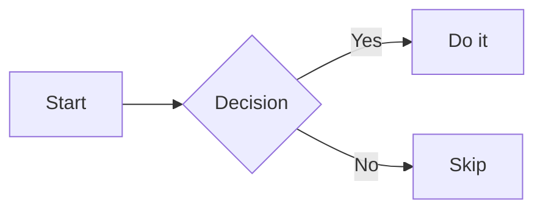
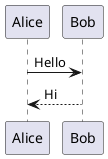
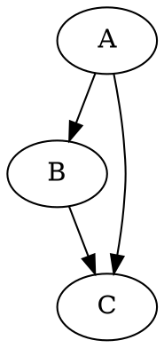

# Math & Diagrams

VNote renders mathematical formulas and several kinds of diagrams directly from your Markdown, so technical notes stay readable in the editor and beautiful in read mode. Everything is written as plain text in fenced blocks — nothing is stored as a binary image.

## Math formulas

VNote uses **MathJax 3** to typeset LaTeX math.

- **Inline** math goes between single dollar signs: `$E = mc^2$`.
- **Block** (display) math goes in a `$$ … $$` block:

```md
$$
\int_{a}^{b} f(x)\,dx = F(b) - F(a)
$$
```

Math renders in read mode and in the editor's in-place and side-by-side previews (see [Editor Basics](editor-basics.md)).

### Customizing MathJax

You can point VNote at a specific MathJax build — for example a local copy for offline use. Copy `web/js/mathjax.js` from the default configuration folder into the same path under your user configuration folder, then edit the script URL, e.g.:

```js
this.mathJaxScript = 'file://c:/Users/foo/mathjax/tex-svg.js';
```

VNote will use your copy instead of the default. See the [FAQ](../help/faq.md#custom-mathjax) for details, and [Settings](../customization/settings.md) for where the configuration folders live.

## Diagrams

VNote renders diagrams from fenced code blocks using several diagram engines. Write the diagram in its own language and VNote turns it into a rendered figure.

### Mermaid

````md

````

### PlantUML

````md

````

### Graphviz (DOT)

````md

````

Other flow/graph formats are supported as well.

## Requirements and settings

- **MathJax** and **Mermaid** render locally and work out of the box.
- **PlantUML** and **Graphviz** may rely on external engines. VNote can use a bundled/online renderer or a locally installed tool (such as Graphviz's `dot` or a PlantUML jar). If a diagram doesn't render, open [Settings](../customization/settings.md) and check the diagram options and any required executable paths.

Because diagrams and math are plain text, they diff cleanly under version control and export together with your note — see [Export](../productivity/export.md).
