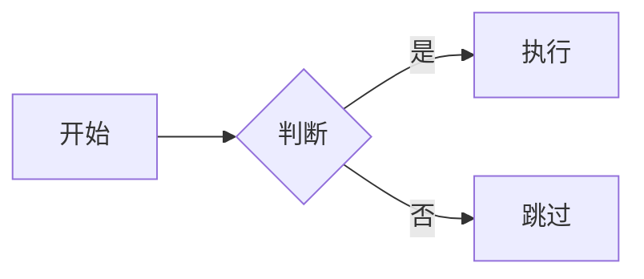
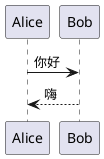
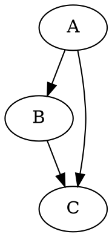

# 数学与图表

VNote 能直接从你的 Markdown 渲染数学公式和多种图表，让技术笔记在编辑器中保持易读、在阅读模式中精美呈现。这一切都以纯文本形式写在围栏代码块中——没有任何内容被存为二进制图片。

## 数学公式

VNote 使用 **MathJax 3** 排版 LaTeX 数学公式。

- **行内**公式放在一对美元符号之间：`$E = mc^2$`。
- **块级**（独立显示）公式放在 `$$ … $$` 块中：

```md
$$
\int_{a}^{b} f(x)\,dx = F(b) - F(a)
$$
```

数学公式会在阅读模式以及编辑器的原位预览和并排预览中渲染（参见[编辑器基础](editor-basics.md)）。

### 自定义 MathJax

你可以让 VNote 使用特定的 MathJax 构建——例如用于离线使用的本地副本。把默认配置文件夹中的 `web/js/mathjax.js` 复制到用户配置文件夹下的相同路径，然后编辑脚本 URL，例如：

```js
this.mathJaxScript = 'file://c:/Users/foo/mathjax/tex-svg.js';
```

VNote 将使用你的副本而非默认版本。详情参见[常见问题](../help/faq.md#custom-mathjax)，配置文件夹位置参见[设置](../customization/settings.md)。

## 图表

VNote 使用多种图表引擎，从围栏代码块渲染图表。用各自的语言编写图表，VNote 会将其转换为渲染后的图形。

### Mermaid

````md

````

### PlantUML

````md

````

### Graphviz（DOT）

````md

````

其他流程图/图形格式同样受支持。

## 依赖与设置

- **MathJax** 和 **Mermaid** 在本地渲染，开箱即用。
- **PlantUML** 和 **Graphviz** 可能依赖外部引擎。VNote 可使用内置/在线渲染器或本地安装的工具（例如 Graphviz 的 `dot` 或 PlantUML 的 jar）。如果某个图表无法渲染，请打开[设置](../customization/settings.md)检查图表选项以及所需可执行文件的路径。

由于图表和数学都是纯文本，它们在版本控制下能干净地对比差异，并与笔记一起导出——参见[导出](../productivity/export.md)。
