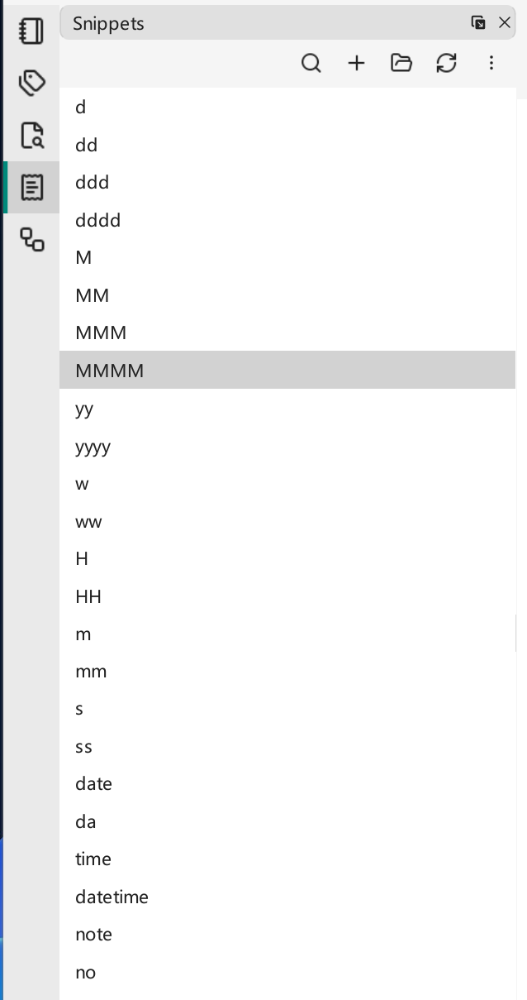

# Snippets

A **snippet** is a reusable piece of text you can insert with a couple of keystrokes. Snippets save you from retyping boilerplate — a code-block scaffold, a colored-text tag, today's date — and can wrap your current selection to reformat it in place.

## Snippet management

Each user-defined snippet is stored as a `json` file, so snippets are just files you can back up or share. VNote also ships **built-in** snippets, such as inserting the current date. Built-in snippets are read-only; you can show or hide them with the panel's *show built-in snippets* toggle.

The **Snippets** dock widget lists everything available.

{ .screenshot loading=lazy }

## Defining a snippet

When you create a snippet, you set:

- **Name** — the identifier used to search for the snippet.
- **Shortcut** — an optional two-digit code to locate a snippet quickly.
- **Cursor Mark** — marks where the cursor lands after the snippet is applied. It should appear **once** in the content.
- **Selection Mark** — marks where selected text is inserted. It may appear **multiple times**; every selection mark is replaced with the selected text when the snippet is applied.

By default the cursor mark is `@@` and the selection mark is `$$` (as used in the examples below).

## Applying a snippet

### From the snippet panel

Place the cursor where you want the text, then double-click a snippet in the snippet panel.

### With shortcuts

In the editor, press `Ctrl+G, I` to bring up a panel of all snippets. From there you can:

- Type a snippet's two-digit code (for example `00`) to apply it directly.
- Type part of a name (for example `my`) to search, then press `Enter` to apply the first match.
- Press `Tab` to move focus between the search box and the snippet list, use the arrow keys to navigate the list, and press `Enter` to apply the selected snippet.

### By symbol

Type `%snippet_name%` directly in the editor and press `Ctrl+G, I` to expand that symbol into the snippet `snippet_name`. Many line-edit fields in VNote also accept this form, including the **New Note** dialog, the **New Notebook** dialog, and note [templates](templates.md).

## Examples

Insert a C++ code block (cursor lands inside):

````
```cpp
@@
```
````

Comment out the selected text:

```
<!-- $$@@ -->
```

Wrap the selection to color or highlight it:

```
<font color=red>$$@@</font>
```

```
<mark>$$@@</mark>
```

To select some text and instantly wrap it, select it, apply the snippet, and the `$$` marks are replaced with your selection while the cursor moves to `@@`.

## Snippets in templates

Because templates support snippets, a template can auto-fill content when you create a note — for example inserting the note name as the title. See [Templates](templates.md).
