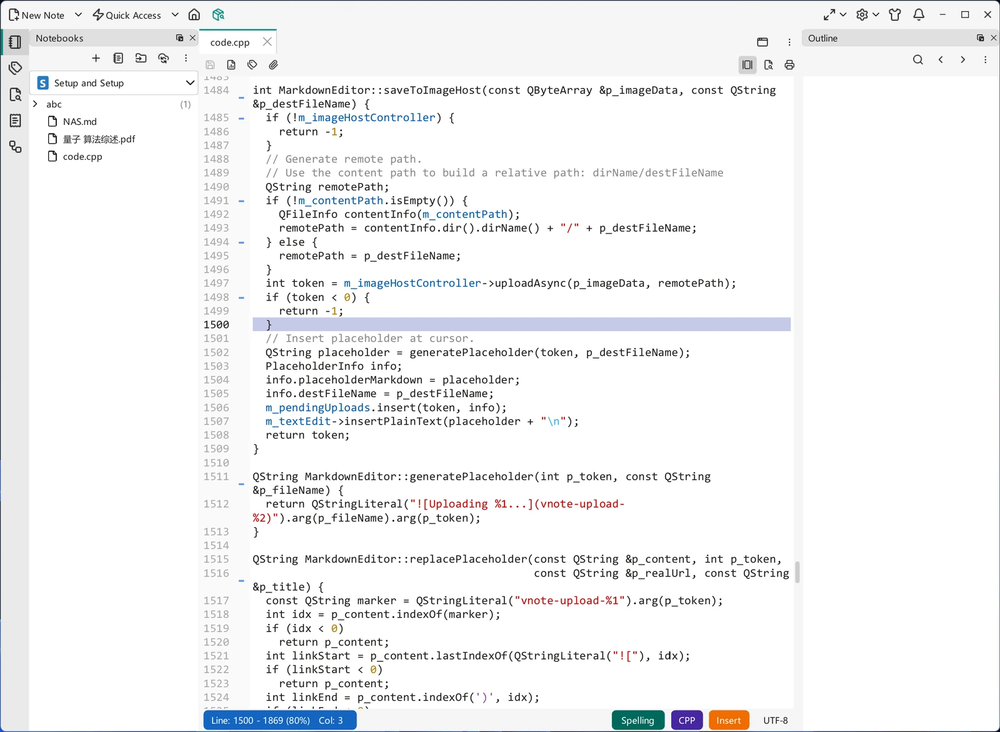

# Text

Not every note is Markdown. VNote's **text editor** opens plain text and source files with syntax highlighting, code folding, and line numbers. It is an edit-only surface: there is no read mode, no preview, and no outline, because plain text has nothing to render.

{ .screenshot loading=lazy }

## Which files open in the text editor

The **Text** file type covers `.txt`, `.text`, and `.log`, plus a long list of source and configuration suffixes — C and C++, Python, Rust, Go, Java, shell scripts, HTML and CSS, JavaScript and TypeScript, JSON, YAML, TOML, INI, SQL, and many more. A file whose suffix is not on the list still opens here when the system reports its contents as plain text, and whatever is left falls under **Others**, which opens in this editor too. See [File Types](../managing-notes/file-types.md).

The suffix list is not fixed: under **Settings → File Associations**, each built-in type has a `;`-separated list of suffixes you can edit.

## Syntax highlighting

Highlighting uses **Kate syntax definitions**. VNote ships around 300 of them in the `syntax-highlighting` folder of the configuration directory — see [Settings](../customization/settings.md) for where that lives. Because the folder is yours, you can add more definition files to it.

The language is picked from the **file extension** alone. There is no content sniffing and no modeline support, so a file with no suffix at all is treated as plain text.

## The status bar

Along the bottom of the editor:

- **Cursor position** — the current line, the total number of lines, how far through the file you are, and the column.
- **Spelling** — a menu with **Enable Spell Check**, **Auto Detect Language**, and whichever dictionaries you have installed. Spell check is off by default.
- **Syntax** — the highlighting language, shown as the file's suffix in upper case (`CPP` for a `.cpp` file). This is an indicator, not a language picker.
- **Insert / Overwrite** — the typing mode. Toggle it with the `Insert` key; clicking the label does nothing.
- **Encoding** — click to reinterpret the file with a different encoding. VNote re-reads the file from disk, so it warns you first if there are unsaved changes.

## Editor settings

Most of the text editor's behavior is configured under **Settings → Text Editor**: line numbers (absolute, relative, or off), text folding, word wrap mode, tab expansion and width, whitespace highlighting, line spacing, zoom, spell check, and the **input mode** — which is where you turn on [Vi mode](vi-mode.md).

!!! note "These settings are shared with the Markdown editor"
    The text editor and the Markdown editor use one set of options, so changing the wrap mode or the line numbering affects both. Spell check is the exception: the Markdown editor keeps its own setting for it.

The common editing actions work here as well — find and replace, word count, printing, readable width, and inserting [snippets](snippets.md) from the context menu.

## Creating a text note

Choose **New Note**, then pick **Text** in the **Type** dropdown. VNote appends the `.txt` extension, so the suggested name is `note.txt`. To create a file with some other extension, type the full name — the type selector follows the suffix you enter. See [File Types](../managing-notes/file-types.md) for what each type does.
