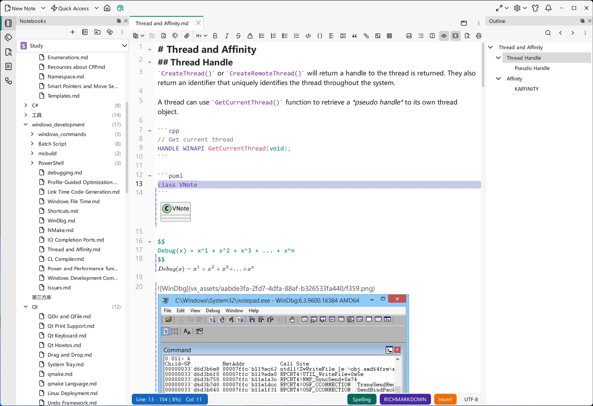
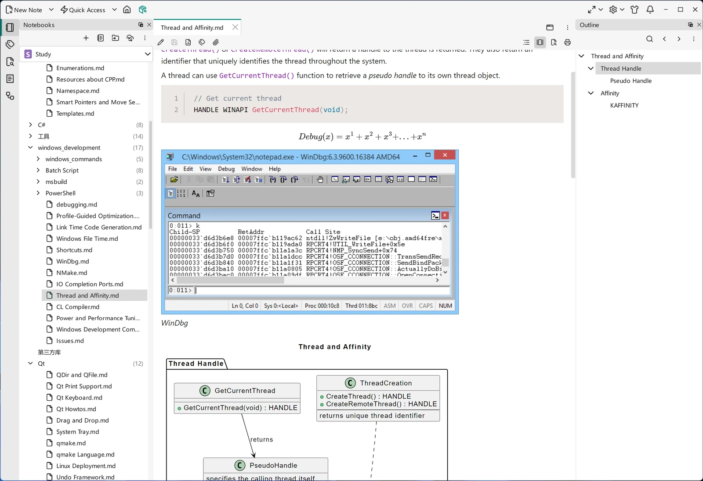
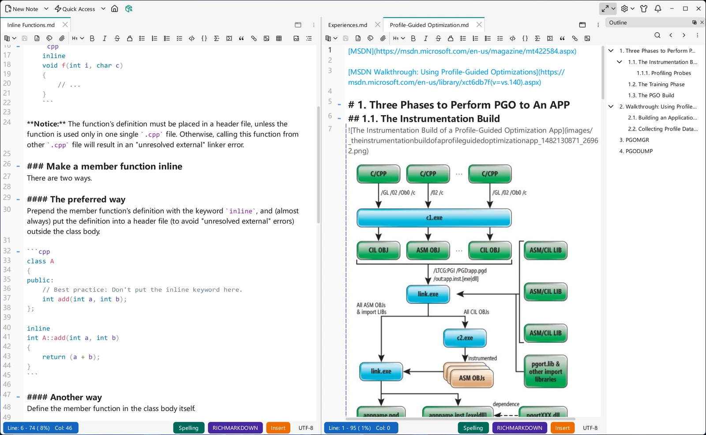
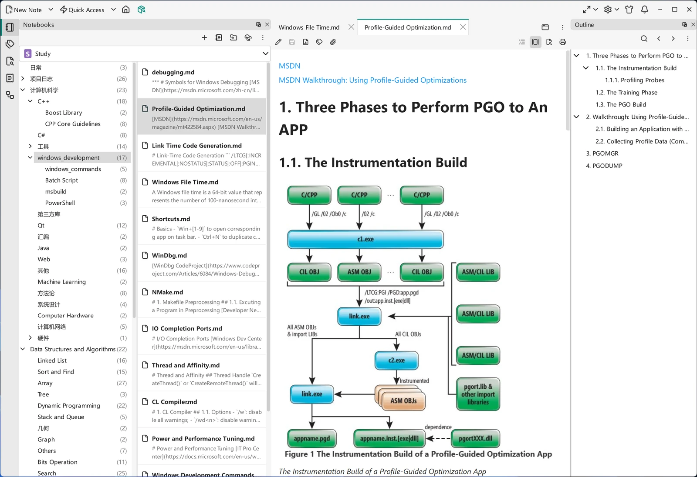
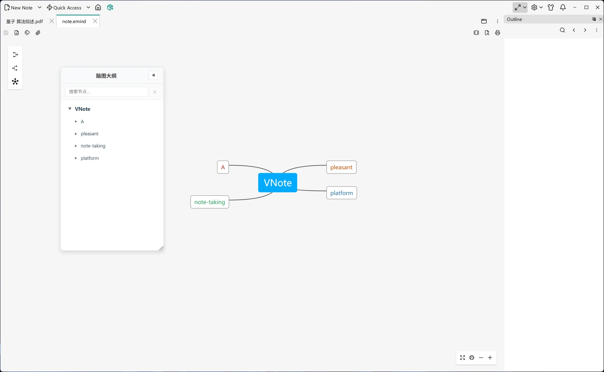
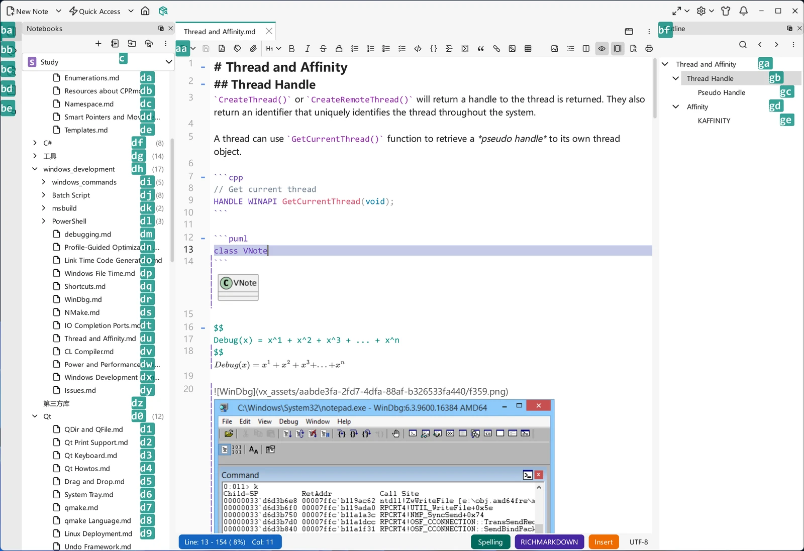
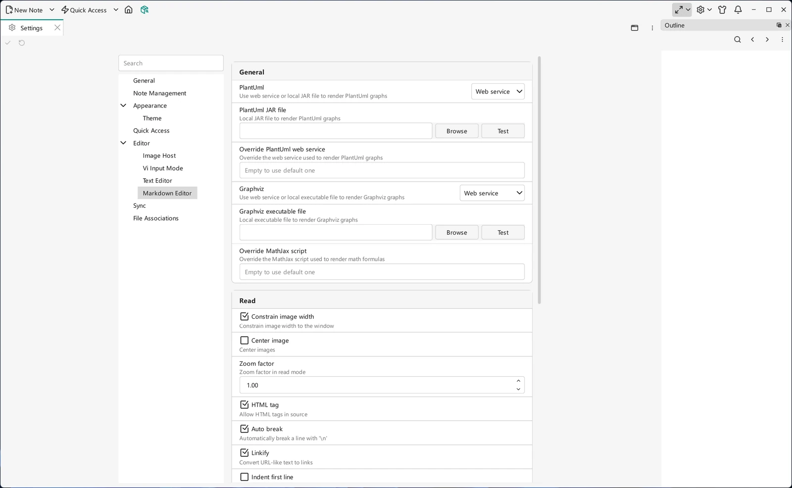
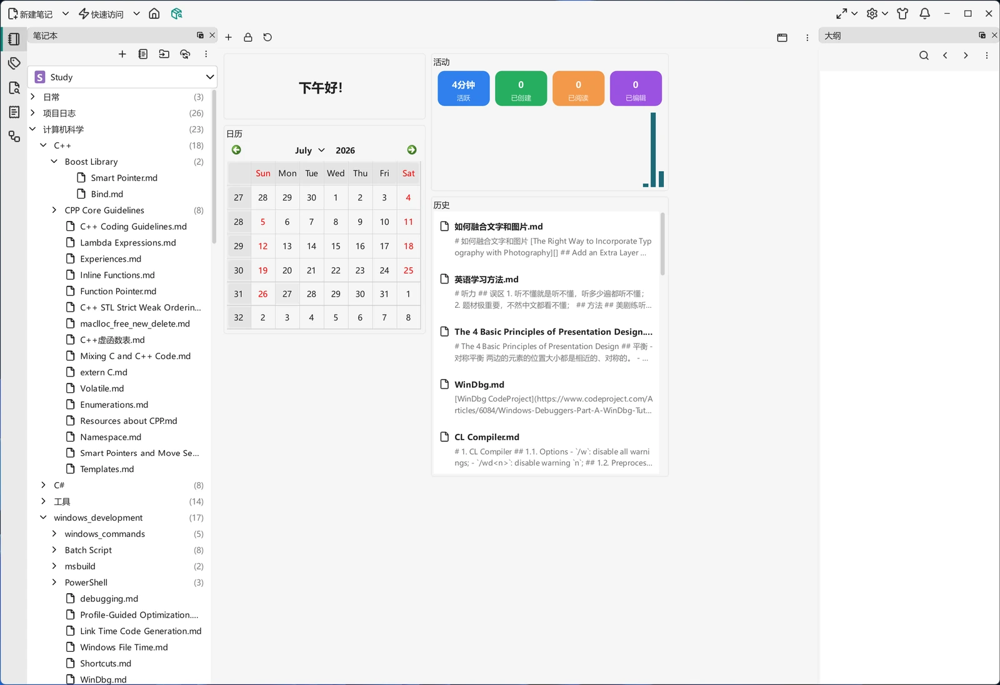

# Gallery

A tour of VNote's main window. Click an image to open it at full size, or follow the link on a card to read more.

-   [{ .screenshot }](assets/screenshots/main.webp)

    __Dashboard__

    ---

    The main window at startup: the Notebooks tree on the left, the dashboard with activity, calendar, and history in the middle, and the outline on the right.

    [:octicons-arrow-right-24: Dashboard](getting-started/dashboard.md)

-   [{ .screenshot loading=lazy }](assets/screenshots/md-edit.webp)

    __Markdown edit mode__

    ---

    Editing a note with line numbers, syntax highlighting, and in-place previews of diagrams and math.

    [:octicons-arrow-right-24: Editor Basics](editing/editor-basics.md)

-   [{ .screenshot loading=lazy }](assets/screenshots/md-read.webp)

    __Markdown read mode__

    ---

    The same note rendered, with code blocks, math, images, and diagrams in their final form.

    [:octicons-arrow-right-24: Editor Basics](editing/editor-basics.md)

-   [{ .screenshot loading=lazy }](assets/screenshots/splits.webp)

    __Side-by-side splits__

    ---

    The content area split into two editor groups, each with its own tabs, toolbar, and status bar.

    [:octicons-arrow-right-24: Editor Basics](editing/editor-basics.md)

-   [{ .screenshot loading=lazy }](assets/screenshots/notes-two-columns.webp)

    __Two-column notebook layout__

    ---

    Separate View, Double Columns puts the folder tree and the selected folder's notes side by side.

    [:octicons-arrow-right-24: Dashboard](getting-started/dashboard.md)

-   [{ .screenshot loading=lazy }](assets/screenshots/text.webp)

    __Text editor__

    ---

    A C++ source file open in the plain text editor, with line numbers and syntax highlighting.

    [:octicons-arrow-right-24: Text](editing/text.md)

-   [{ .screenshot loading=lazy }](assets/screenshots/mindmap.webp)

    __Mind map editor__

    ---

    A mind map open in the built-in editor, with a searchable outline of its nodes.

    [:octicons-arrow-right-24: Mind Maps](editing/mind-maps.md)

-   [{ .screenshot loading=lazy }](assets/screenshots/pdf.webp)

    __PDF viewer__

    ---

    A PDF opened in the built-in viewer, with page navigation and zoom in the same window.

    [:octicons-arrow-right-24: File Types](managing-notes/file-types.md)

-   [{ .screenshot loading=lazy }](assets/screenshots/search.webp)

    __Search__

    ---

    The Search dock with keyword, mode, and scope options; matches are listed in the Location List below.

    [:octicons-arrow-right-24: Search Panel](search/search-panel.md)

-   [{ .screenshot loading=lazy }](assets/screenshots/united-entry.webp)

    __United Entry__

    ---

    United Entry opened over the main window, with inline help for the entry command you are typing.

    [:octicons-arrow-right-24: United Entry](search/united-entry.md)

-   [{ .screenshot loading=lazy }](assets/screenshots/navigation-mode.webp)

    __Navigation mode__

    ---

    Key labels are overlaid on panels and items so you can jump anywhere without touching the mouse.

    [:octicons-arrow-right-24: Keyboard Shortcuts](customization/keyboard-shortcuts.md)

-   [{ .screenshot loading=lazy }](assets/screenshots/settings.webp)

    __Settings__

    ---

    Settings opens as a tab in the main window, with categories on the left and searchable options on the right.

    [:octicons-arrow-right-24: Settings](customization/settings.md)

-   [{ .screenshot loading=lazy }](assets/screenshots/main-pure.webp)

    __Pure theme__

    ---

    The same window with the Pure theme applied. VNote ships several themes and styles, and you can add your own.

    [:octicons-arrow-right-24: Themes & Styles](customization/themes-and-styles.md)

