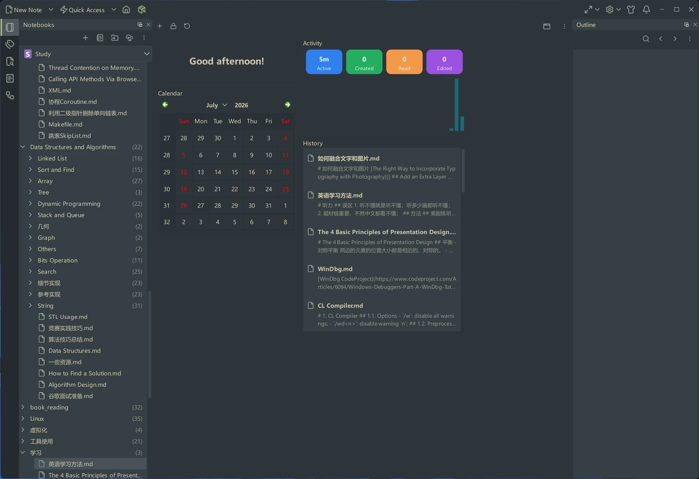

# VNote

**一个舒适的笔记平台。**

VNote 是一款免费、开源、基于 Qt 的笔记应用，专注于 Markdown。它不仅是一个编辑器，更将出色的编辑体验与强大的笔记管理融为一体，并且支持 **Linux**、**Windows** 和 **macOS**。

[开始使用](getting-started/index.md){ .md-button .md-button--primary }
[下载 VNote](https://github.com/vnotex/vnote/releases/latest){ .md-button }

{ .screenshot }

## 为什么选择 VNote

-   :material-lock-outline:{ .lg .middle } __数据自主掌控__

    ---

    所有笔记都是保存在本地磁盘上的纯文本。一个笔记本对应一个目录——不依赖数据库，没有厂商锁定。可自由选择第三方同步服务，或使用按笔记本的 git 同步。

-   :material-folder-multiple-outline:{ .lg .middle } __直观的笔记管理__

    ---

    独立的笔记本、无限层级的文件夹和开放的笔记。通过标签、快速访问和历史记录进行组织，还能直接浏览和编辑外部文件。

-   :material-language-markdown:{ .lg .middle } __舒适的 Markdown 体验__

    ---

    原地预览与双边实时预览、语法高亮、交互式大纲、高效的图片管理，以及数学公式和图表（PlantUML、Graphviz、Mermaid 等）。

-   :material-tune:{ .lg .middle } __为进阶用户打造__

    ---

    Vi 模式、丰富的快捷键、多标签页与窗口分割、模糊查找和跳转，并可通过主题、样式和软件行为进行深度定制。

## 浏览文档

-   :material-rocket-launch-outline:{ .lg .middle } __快速开始__

    ---

    安装 VNote，记录第一篇笔记，并了解仪表盘。

    [:octicons-arrow-right-24: 快速开始](getting-started/index.md)

-   :material-notebook-outline:{ .lg .middle } __管理笔记__

    ---

    组织笔记本、文件夹和笔记；使用标签、同步、快速访问和历史记录。

    [:octicons-arrow-right-24: 管理笔记](managing-notes/index.md)

-   :material-pencil-outline:{ .lg .middle } __编辑__

    ---

    在 VNote 的各类编辑器中书写与排版——Markdown、数学公式、图表、片段、模板、思维导图和 Vi 模式。

    [:octicons-arrow-right-24: 编辑](editing/index.md)

-   :material-magnify:{ .lg .middle } __搜索__

    ---

    通过搜索面板和统一入口快速找到笔记。

    [:octicons-arrow-right-24: 搜索](search/index.md)

-   :material-lightning-bolt-outline:{ .lg .middle } __效率__

    ---

    使用任务自动化工作，并将笔记导出为其他格式。

    [:octicons-arrow-right-24: 效率](productivity/index.md)

-   :material-cog-outline:{ .lg .middle } __自定义__

    ---

    配置设置，应用主题与样式，并自定义键盘快捷键。

    [:octicons-arrow-right-24: 自定义](customization/index.md)

## 开源和自由

- 遵从 [GNU LGPLv3](https://opensource.org/licenses/LGPL-3.0) 开源协议。
- 由 Qt 和 C++ 提供强劲性能。
- 支持 Linux、Windows 和 macOS。

## 参与其中

- 在 [GitHub](https://github.com/vnotex/vnote) 上关注并 Star VNote。
- 通过 [GitHub Issues](https://github.com/vnotex/vnote/issues) 反馈问题。

!!! tip "需要帮助？"
    请查阅[帮助](help/index.md)章节，获取常见问题解答和数据迁移指南。
