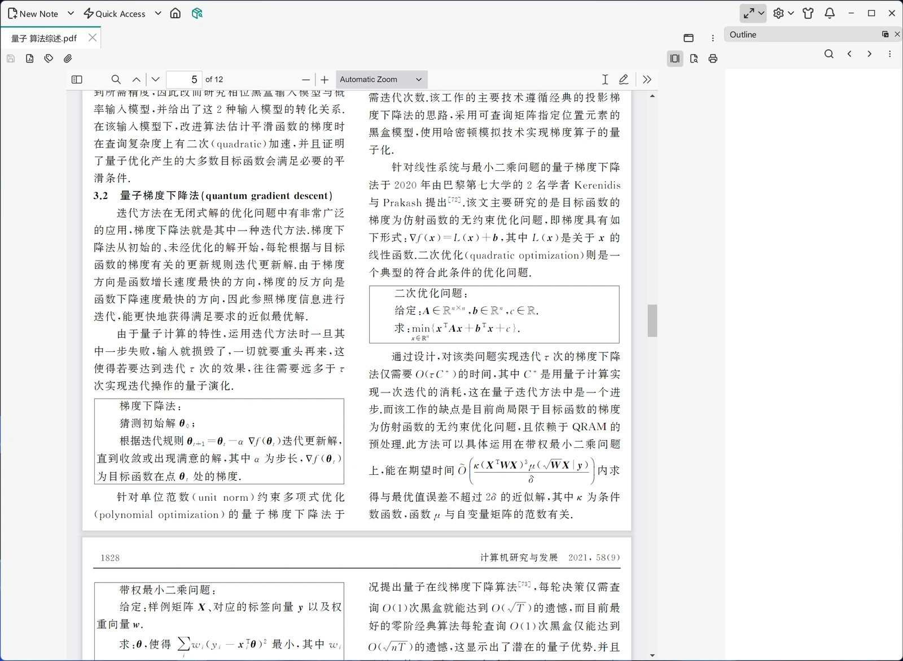

# File Types

A VNote note is just a file on disk, and VNote recognizes a handful of built-in file types by their extension. The type decides which editor or viewer opens the file, and whether you can create a new note of that type.

## Supported types

| Type | Extensions | Opens in | Create as a new note? |
|------|------------|----------|-----------------------|
| **Markdown** | `.md`, `.mkd`, `.rmd`, `.markdown` | Markdown editor | Yes |
| **Text** | `.txt`, `.text`, `.log`, and any other file detected as plain text | Text editor | Yes |
| **Mind Map** | `.emind` | Mind-map editor | Yes |
| **PDF** | `.pdf` | Built-in PDF viewer | No — view only |
| **Others** | anything else | Your system's default program | Yes — no extension is added |

Markdown is the core note type and gets VNote's full editing experience — see [Editing](../editing/index.md). Mind maps are a distinct visual note type covered in [Mind Maps](../editing/mind-maps.md).

{ .screenshot loading=lazy }

## How the type is chosen

VNote matches a file's extension against the table above. A file whose extension is not listed but whose contents are plain text is treated as a **Text** file, so you can open and edit it directly. Anything else falls under **Others** and is handed off to the program your operating system associates with it.

## Creating notes

When you choose **New Note**, the **Type** dropdown lets you create a **Markdown**, **Text**, **Mind Map**, or **Others** note — **Others** creates a file without adding any extension. PDF is the one type you cannot create: it is view-only, so you can open and read a `.pdf` that lives in a notebook, but you cannot create a new PDF note from within VNote. (VNote can still *export* your notes to PDF — see [Export](../productivity/export.md).)

Because everything is just files, you can also drop files of any of these types into a notebook folder on disk, and VNote will open each one with the matching editor or viewer.
