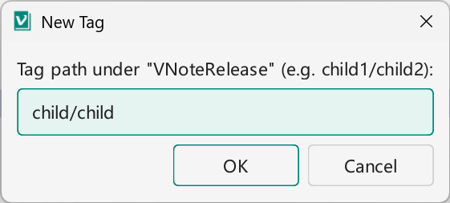
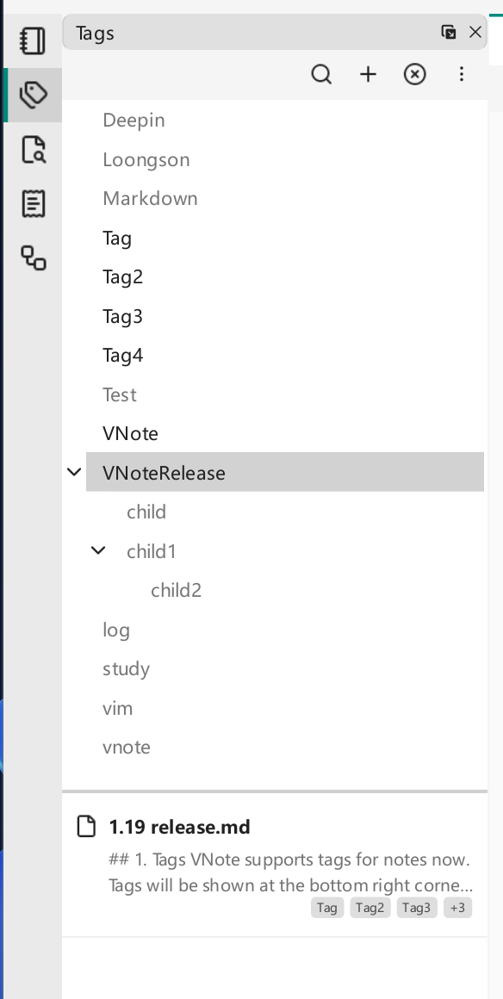

# Tags

Folders organize notes by location — a note lives in exactly one folder. **Tags** organize notes by topic, and a note can carry as many tags as you like. Together they let you keep a tidy folder tree while still grouping related notes that live far apart in it.

!!! note "Tags require a bundled notebook"
    Tags are stored in the notebook's index, which only [bundled notebooks](notebooks-folders-notes.md#which-type-should-i-use) have. In a raw notebook the **Tags** button is not shown, and the tag popup reports that tags are not supported for that notebook type.

## What tags are for

Use tags whenever a single folder can't capture how you think about a note. A meeting note might be tagged `project-x` and `2026-q1`; a code snippet note might be tagged `python` and `reference`. Later you can pull up every note with a given tag regardless of where it sits in the folder tree.

Tags are stored in the notebook's configuration, so they travel with the notebook when you copy or [sync](notebook-sync.md) it.

## Add and remove tags

Open a note and use the **Tags** button in the note's toolbar to add one or more tags in the tag popup. Type a new tag name to create it, or pick from tags you already use. Remove a tag from a note the same way. A note keeps working exactly as before — tagging changes nothing in the Markdown file's content.

{ .screenshot loading=lazy }

## Browse notes by tag

The **Tags** dock widget lists all tags in the current notebook. Select a tag to see every note that carries it, then open a note directly from the list. This turns a scattered set of notes into a focused, topic-based view.

{ .screenshot loading=lazy }

## Find notes by tag with United Entry

[United Entry](../search/united-entry.md) can search by tag, so you can jump to tagged notes from the keyboard without opening the dock. Use the `find` command with the tag object and a scope:

- `find -b tag -s notebook` — search by tag in the current notebook.
- `find -b tag -s folder` — search by tag in the current folder.
- `find -b tag -s all_notebook` — search by tag across all notebooks.

Type the command, then the tag keyword, to filter instantly.

## Tips

- Keep a small, consistent vocabulary of tags — a handful of well-chosen tags is more useful than many one-off ones.
- Combine tags with [Quick Access & History](quick-access-history.md) and [Search](../search/index.md) to move quickly between related notes.
