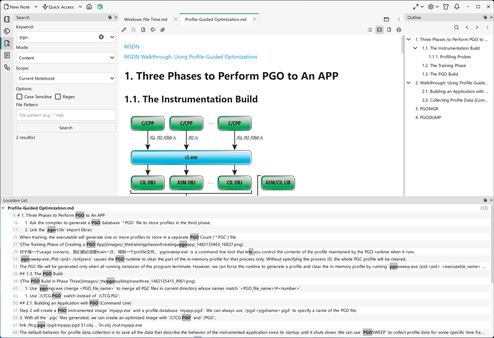

# 搜索面板

**搜索**停靠部件是 VNote 完整的搜索界面。相比之下，[统一入口](united-entry.md)是一个快速、命令驱动的跳转框，而搜索面板则提供了一整套选项，用于按名称或内容在你的笔记本中查找笔记。

## 打开搜索

从导航栏或其快捷键打开**搜索**停靠部件。输入查询词，选择范围和目标，然后执行搜索；结果显示在面板中，选择其一即可打开对应笔记。

{ .screenshot loading=lazy }

## 你能搜索什么

搜索有两个维度：**匹配什么**以及**在哪里查找**。

匹配对象：

- **内容**——笔记内部的文本（全文搜索）。
- **名称**——文件夹和文件的名称。
- **标签**——携带某个[标签](../managing-notes/tags.md)的笔记。

查找范围：

- **所有笔记本**——你在 VNote 中打开的一切。
- **当前笔记本**——你正在使用的笔记本。
- **当前文件夹**——所选文件夹，以及在适用时其子文件夹。
- **缓冲区**——当前在标签页中打开的笔记。

将这些组合起来，你就能从宽泛的「在任何地方找到这个短语」精确到「在这个文件夹里找到这个名称」。

## 搜索选项

面板提供用于优化查询的选项：区分大小写、正则表达式，以及通配符文件模式。当普通关键词返回过多结果时，用它们收紧结果。

## 处理搜索结果

结果列出匹配的笔记（对于内容搜索还会列出匹配的行）。选择某个结果即可在匹配处打开笔记。随后，[大纲](../editing/editor-basics.md)和笔记内查找可帮你精确定位。

## 搜索面板与统一入口

- 当你需要选项——范围、匹配类型、正则——以及可浏览的结果列表时，使用**搜索面板**。
- 当你明确知道要找什么，并且更愿意输入一条简短命令直接跳转、不离开键盘时，使用[统一入口](united-entry.md)。

两者依赖同一个索引，因此它们是同一套快速搜索的两个前端。
