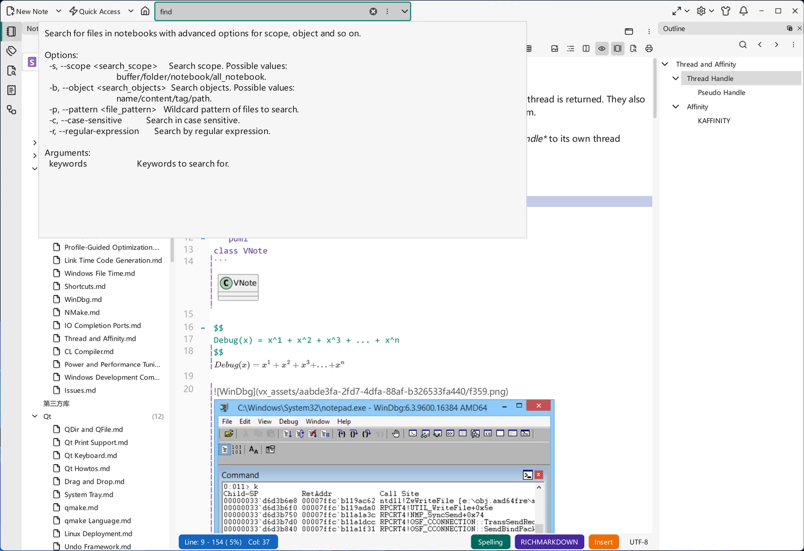

# United Entry

**United Entry** is VNote's command-driven quick search. Instead of opening a panel and setting options, you activate a single box, type a short **entry command** followed by your **search criteria**, and jump straight to a folder, note, or file — all from the keyboard.

## Activation

By default, press `Ctrl+G, G` to activate United Entry. You can change this by editing `"UnitedEntry": "Ctrl+G, G"` in the configuration file (see [Settings](../customization/settings.md)) to whatever shortcut you prefer.

Once open, typing an entry command filters the box to that command's mode. Adding a **space** after the command triggers a second, detailed help display for that command.

{ .screenshot loading=lazy }

## Entry commands

United Entry ships with four built-in commands plus a few short aliases for common searches. Combine a command with a keyword to run the query.

Built-in commands:

| Command    | Description                             |
| ---------- | --------------------------------------- |
| `find`     | Search for files in notebooks           |
| `help`     | Help information about United Entry      |
| `history`  | Recently opened files                   |
| `windows`  | Open windows across workspaces          |

Default aliases (shortcuts for common `find` queries):

| Alias | Description                                    | Expands to                              |
| ----- | ---------------------------------------------- | --------------------------------------- |
| `n`   | Search files by name in the current notebook   | `find --scope notebook --object name`   |
| `g`   | Search files by content in the current notebook| `find --scope notebook --object content`|
| `b`   | Search files by content in open buffers        | `find --scope buffer --object content`  |
| `f`   | Search files by name in the current folder     | `find --scope folder --object name`     |

You can also call `find` directly with options for full control:

- `-s, --scope` — `buffer`, `folder`, `notebook`, or `all_notebook`.
- `-b, --object` — `name`, `content`, `tag`, or `path`.
- `-p, --pattern` — a wildcard file pattern to restrict the search.
- `-c, --case-sensitive` — match case exactly.
- `-r, --regular-expression` — treat the keyword as a regular expression.

## Adding your own aliases

The four default aliases cover only a slice of what `find` can do. You can define your own single-letter (or short) aliases in the configuration file under `core.unitedEntry.alias` (see [Settings](../customization/settings.md)). Each alias is an object with a `name` (what you type), a `description` (shown in the help list), and a `value` (the `find` command it expands to):

```json
"core": {
    "unitedEntry": {
        "alias": [
            {
                "name": "q",
                "description": "Search for files by name in all notebooks",
                "value": "find --scope all_notebook --object name"
            },
            {
                "name": "a",
                "description": "Search for files by content in all notebooks",
                "value": "find --scope all_notebook --object content"
            },
            {
                "name": "z",
                "description": "Search for files by tag in all notebooks",
                "value": "find --scope all_notebook --object tag"
            },
            {
                "name": "e",
                "description": "Search for files by name in current notebook",
                "value": "find --scope notebook --object name"
            },
            {
                "name": "c",
                "description": "Search for files by tag in current notebook",
                "value": "find --scope notebook --object tag"
            },
            {
                "name": "t",
                "description": "Search for files by name in open buffers",
                "value": "find --scope buffer --object name"
            }
        ]
    }
}
```

Mix and match any `--scope` with any `--object` (`name`, `content`, `tag`, `path`) to build the shortcuts you use most. Restart VNote for new aliases to take effect.

!!! note "Migrating aliases from older VNote"
    Older VNote versions used a top-level `united_entry.alias` key and a `--target file|folder|notebook` option. In the current version, aliases live under `core.unitedEntry.alias` and `find` no longer takes `--target` — use `--scope` and `--object` instead.

## Examples

- `n 02` — find files whose name contains `02` in the current notebook.
- `g interface` — search the current notebook for notes whose content contains `interface`.
- `b task` — find `task` among the currently open buffers.
- `find -b tag -s all_notebook java` — find notes tagged `java` across all notebooks.

## Locating a result

!!! warning "This behaves differently per operating system"

    **macOS** — after results appear, press `Tab` to move the cursor into the results list below, then press `Enter` to open the target.

    **Windows** — after searching, the first result is selected by default, so you can press `Enter` to open it immediately, or move the selection first and then open.

## United Entry vs. the search panel

United Entry is fastest when you know what you want and want to jump. When you need browsable results and refinement options (regex, case sensitivity), use the [Search Panel](search-panel.md) instead — both use the same underlying search.
